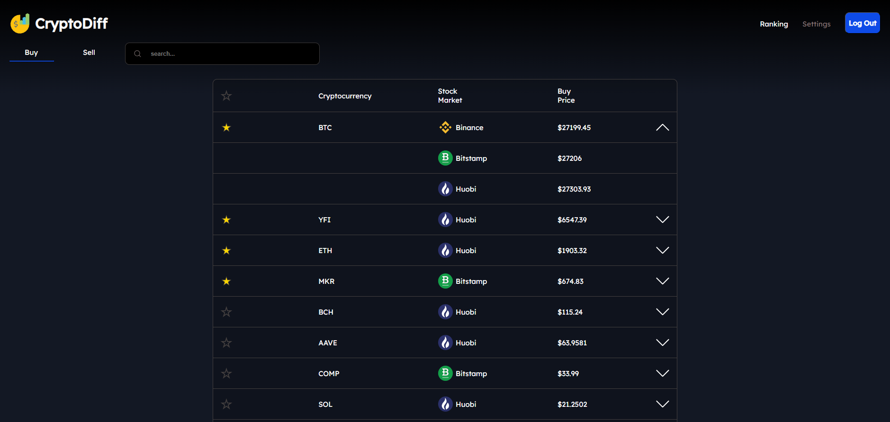
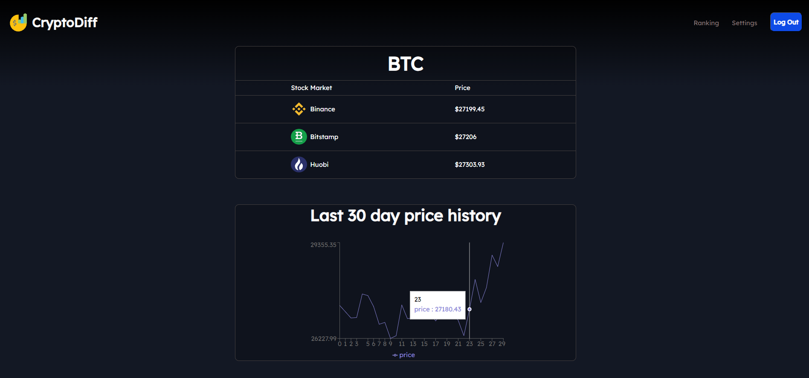
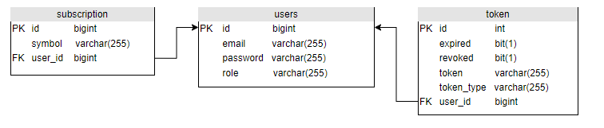

# Cryptodiff

A web application that offers comparison
of buying and selling prices
on centralized cryptocurrency exchanges.

We offer insight into cryptocurrency prices on exchanges:
* Binance
* Huobi
* Bitstamp

Subscribe to your favorite cryptocurrencies and monitor
the best prices, so you don't miss out!

Search for interesting cryptocurrencies.

Follow trends on the chart.

Log in to your account to subscribe to cryptocurrencies.

## Technologies
* Java
* Spring Boot
* MySQL
* Docker
* React
* JavaScript
* HTML
* CSS

## Database

## Authors

* [@Bolivin20](https://github.com/Bolivin20)
* [@zannna](https://github.com/zannna)
* [@pepeni](https://github.com/pepeni)
* [@DarkMaff00](https://github.com/DarkMaff00)

